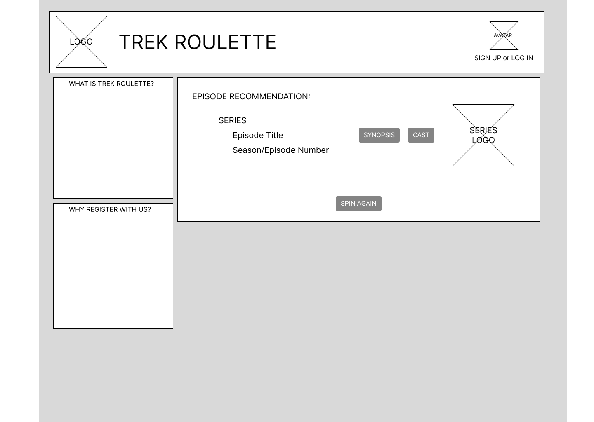
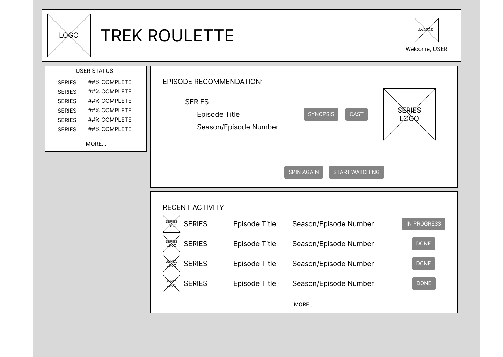
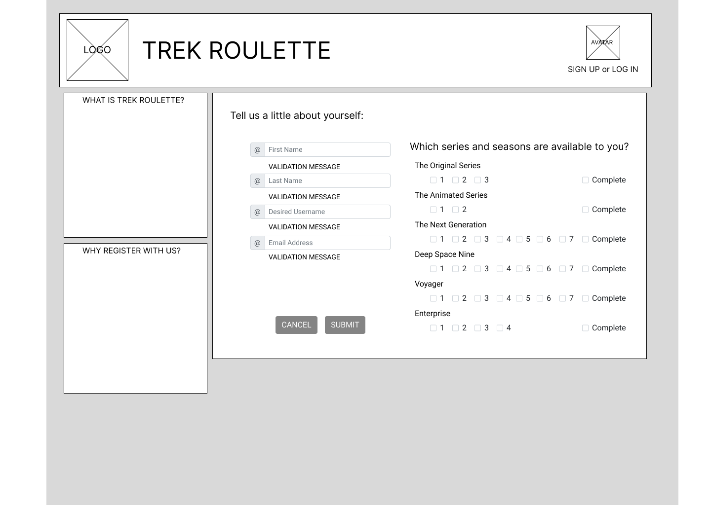
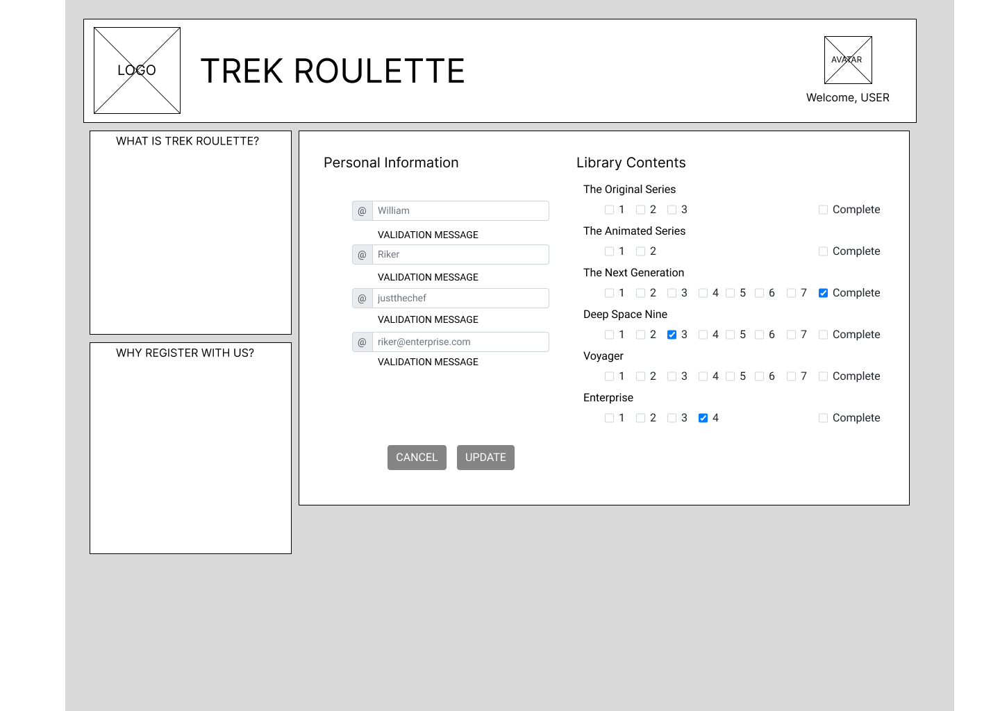
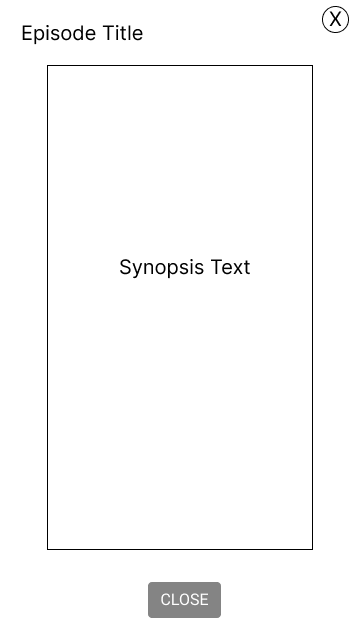
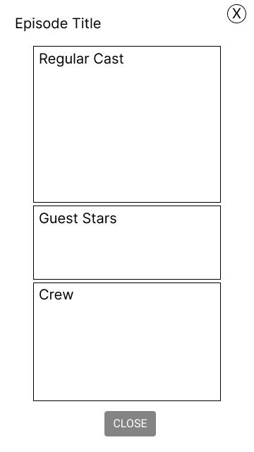

### Home Page - User not registered or not logged in

* Login option available in header
* Identity materials in header
* Episode recommendation generated, but not tailored to user
* Sidebar details about the app and the benefits of registration

### Home Page - User logged in

* Access to profile via welcome link
* Identity materials in header
* Episode recommendation generated from user settings
* Sidebar details progress of user viewing

### User Registration Page

* Access to profile via welcome link
* Identity materials in header
* Sidebar reminders about the app and the benefits of registration
* Registration form collects personal identifiers
* Inventory data collected to filter random selection after registered
  (My error: the "SIGN UP or LOG IN" should read "Welcome, USER")

### Profile Editing Page

* Access to profile via welcome link (leads to unchanged form)
* Identity materials in header
* Sidebar Reminders about the app and the benefits of registration
  * Should change to other information, but uncertain at this time what they would be
* Loaded personal information from database displayed
* Allows modification of user data
* Possibly add ability to delete user account as well?

### Modal: Episode Plot Synopsis

* Pops up over home page when clicked via random episode generator
* Displays episode name and plot summary
* Closed via "X" or button
* Cannot click or interact with the page behind the modal without closing the modal first

### Modal: Cast and Crew Summary

* Pops up over home page when clicked via random episode generator
* Displays episode name, regular cast, guest stars, and key crew (writer, director)
* Closed via "X" or button
* Cannot click or interact with the page behind the modal without closing the modal first
